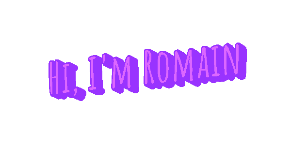

Software Engineering Student • Full Stack Developer • Montréal 🇨🇦

---

### About me

- 🇫🇷 French Software Engineering student at **École de technologie supérieure (ÉTS)**
- 💻 Passionate about frontend development, UI/UX and modern web technologies
- 🌱 Always learning and building personal projects
- 📫 **romainboiret@gmail.com**

### Tools

  

---

*"Building things that are simple, elegant and enjoyable to use."*

