 

 

### 👋 À propos
- 🇫🇷 Étudiant en génie logiciel à l'**École de technologie supérieure (ÉTS)**
- 💻 Passionné de frontend, d'UI/UX et de technologies web modernes
- 🌱 Toujours en train d'apprendre en construisant des projets perso
- 📫 **romainboiret@gmail.com**

### 🛠️ Tools

  

### 🚀 Projets
- **[Pomikit UI](https://romainboiret.github.io/Pomikit-ui/)** - design system Nuxt 3 + TypeScript, Storybook, dark mode
- **[Fish&Fric Remastered](https://fish-fric-remastered-psi.vercel.app/)** - banque ocean-themed, Next.js + Prisma
- **[Fidelio](https://fidelio-sand.vercel.app/)** - app React Native, scan de cartes de fidélité

 

  <i>"Building things that are simple, elegant and enjoyable to use."</i>

 

 

### 👋 À propos
- 🇫🇷 Étudiant en génie logiciel à l'**École de technologie supérieure (ÉTS)**
- 💻 Passionné de frontend, d'UI/UX et de technologies web modernes
- 🌱 Toujours en train d'apprendre en construisant des projets perso
- 📫 **romainboiret@gmail.com**

### 🛠️ Tools

  

### 🚀 Projets
- **[Pomikit UI](https://romainboiret.github.io/Pomikit-ui/)** - design system Nuxt 3 + TypeScript, Storybook, dark mode
- **[Fish&Fric Remastered](https://fish-fric-remastered-psi.vercel.app/)** - banque ocean-themed, Next.js + Prisma
- **[Fidelio](https://fidelio-sand.vercel.app/)** - app React Native, scan de cartes de fidélité

### 📊 GitHub Stats

  
  

 

  <i>"Building things that are simple, elegant and enjoyable to use."</i>

